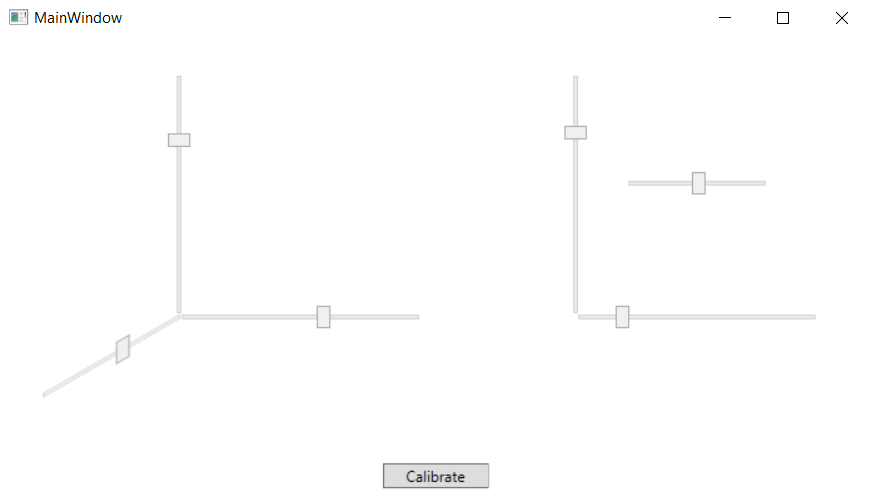
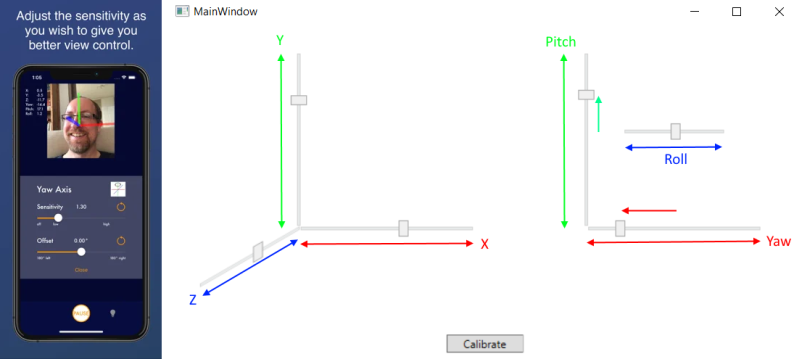

# FaceTracking

## Description

This is a simple demo app showing how to receive and process head tracking data sent via UDP - it is not a complete head tracking software. 

## Installation

The [.NET 5](https://docs.microsoft.com/en-us/dotnet/core/dotnet-five) solution requires the [.NET 5 SDK](https://dotnet.microsoft.com/download/dotnet/5.0) to compile and run. (If you also want to edit the source code, use [Visual Studio](https://visualstudio.microsoft.com/de/vs/community/) or [Visual Studio Code](https://code.visualstudio.com/download).)

In the main directory (containing the file [HeadTracking.sln](./HeadTracking.sln)), enter the command

    dotnet build

to build the application. Then change to directory [DemoApp](./DemoApp) and enter

    dotnet run

You should see the main window of the running application:



## Usage and Background

This application listens to UDP packets with head tracking data and shows the information on position (x/y/z) and rotation (yaw/pitch/roll). In other words, it does not track anything by itself, but relies on other software to provide the head tracking data.

Apps like [SmoothTrack: Head Tracker](https://apps.apple.com/us/app/smoothtrack-head-tracker/id1528839485) by [John Goering](https://apps.apple.com/us/developer/john-goering/id507507566) use the [AR features of iOS to track faces](https://developer.apple.com/documentation/arkit/content_anchors/tracking_and_visualizing_faces) and provide the data as input for desktop applications like Microsoft Flight Simulator, allowing to look around the cockpit with head movement. 

Normally, you would use [OpenTrack](https://github.com/opentrack/opentrack) on the desktop computer to receive the data sent by this app (using "UDP over network" as the input source). This tool supports several types of output including FlightGear, freetrack 2.0 Enhanced, Microsoft FSX Simconnect. When looking into the different options, it turned out to be easier to just listen to UDP packets sent by SmoothTrack directly instead of working with the OpenTrack outputs.

SmoothTrack sends UDP packets with 48 bytes - these are just six floating point numbers of type ``double`` (three for the x/y/z movement, three for the yaw/pitch/roll rotation). All that is required is to copy the bytes to an ``array`` of ``double``s:

````cs
    var bytes = udpServer.Receive(ref remoteEndpoint);
    // ...
    Buffer.BlockCopy(bytes, 0, asDoubles, 0, bytes.Length); 
````

&rarr; see [SmoothTrackListener.cs](./SmoothTrackServer/SmoothTrackListener.cs) for details.

To use this class, you can simply call:

````cs
    var listener = new SmoothTrackListener(4242);
    listener.Start(data =>
    {
        this.Dispatcher.Invoke(() =>
        {
            sldX.Value = - data.X;
            sldY.Value = + data.Y;
            sldZ.Value = - data.Z;
            sldYaw.Value   = + data.Yaw;
            sldPitch.Value = + data.Pitch;
            sldRoll.Value  = - data.Roll;
        });
    });
````

&rarr; see [MainWindow.xaml.cs](./DemoApp/MainWindow.xaml.cs) for a complete example.

To run the demo app, you need an app providing input via UDP. 

* Run the demo app (in Visual Studio or in a terminal using the command ``dotnet run``)
* Start the app providing head tracking input (I use [SmoothTrack: Head Tracker](https://apps.apple.com/us/app/smoothtrack-head-tracker/id1528839485))

You should see the sliders on the demo app moving in accordance with your head movement.




## Credits

Again, this code does not do any head tracking itself, but relies on other software for that. I use the fabulous app [SmoothTrack: Head Tracker](https://apps.apple.com/us/app/smoothtrack-head-tracker/id1528839485) by [John Goering](https://apps.apple.com/us/developer/john-goering/id507507566) which has many glowing reviews and a well-deserved rating of 4.7. 
